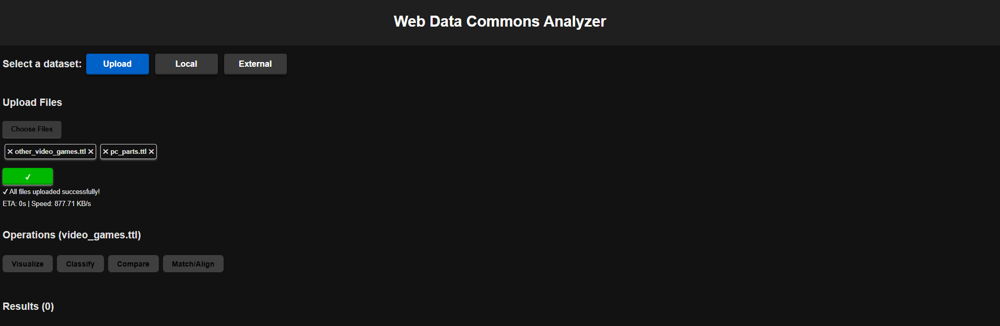
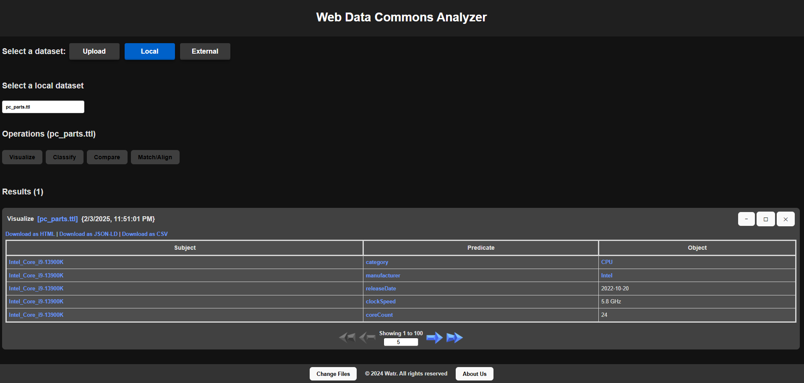
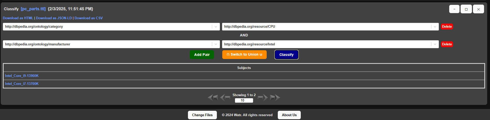
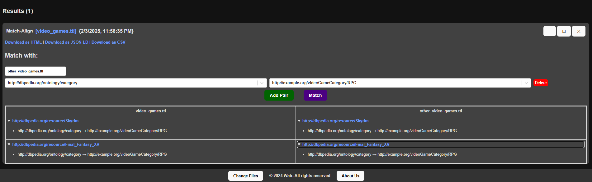
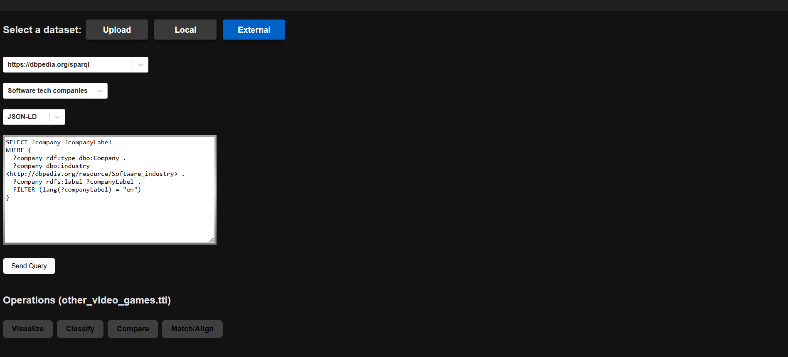

<div align="center">

  
  <h1>Web Data Commons Analyzer</h1>

<p>
  <a href="https://github.com/andrei-v-stan/watr/graphs/contributors">
    
  </a>
  <a href="">
    
  </a>
  <a href="https://github.com/andrei-v-stan/watr/issues/">
    
  </a>
</p>

<p>
  <a href="https://github.com/andrei-v-stan/watr/network/members">
    
  </a>
  <a href="https://github.com/andrei-v-stan/watr/stargazers">
    
  </a>
  <a href="https://github.com/andrei-v-stan/watr/blob/main/LICENSE">
    
  </a>
</p>

<p>
  <a href="https://www.uaic.ro/">
    
  </a>
  <a href="https://www.info.uaic.ro/">
    
  </a>
  <a href="https://profs.info.uaic.ro/sabin.buraga/teach/courses/wade/index.html">
    
  </a>
  <a href="https://profs.info.uaic.ro/sabin.buraga/teach/courses/wade/">
    
  </a>
</p>
   
<h4>
    <a href="https://github.com/andrei-v-stan/watr/">View Demo</a>
  <span> · </span>
    <a href="https://github.com/andrei-v-stan/watr/">Documentation</a>
  <span> · </span>
    <a href="https://github.com/andrei-v-stan/watr/issues/">Report Bug</a>
  <span> · </span>
    <a href="https://github.com/andrei-v-stan/watr/issues/">Request Feature</a>
  </h4>

</div>


<br>


# :notebook_with_decorative_cover: Table of Contents

- [:notebook\_with\_decorative\_cover: Table of Contents](#notebook_with_decorative_cover-table-of-contents)
  - [:magic\_wand: About the Project](#magic_wand-about-the-project)
    - [:camera: Screenshots](#camera-screenshots)
    - [:art: Color Reference](#art-color-reference)
    - [:space\_invader: Tech Stack](#space_invader-tech-stack)
    - [:dart: Features](#dart-features)
    - [:key: Environment Variables](#key-environment-variables)
  - [:toolbox: Getting Started](#toolbox-getting-started)
    - [:ballot\_box: Prerequisites](#ballot_box-prerequisites)
    - [:wrench: Run Locally (Development Mode)](#wrench-run-locally-development-mode)
    - [:gear: Deployment Mode](#gear-deployment-mode)
  - [:cd: Usage](#cd-usage)
  - [:movie\_camera: Tutorial](#movie_camera-tutorial)
  - [:card\_index\_dividers: Contributing](#card_index_dividers-contributing)
  - [:spiral\_calendar: Roadmap](#spiral_calendar-roadmap)
  - [:mailbox: FAQ](#mailbox-faq)
  - [:black\_nib: License](#black_nib-license)
  - [:email: Contact](#email-contact)
  - [:bookmark: Acknowledgements](#bookmark-acknowledgements)

<br>

## :magic_wand: About the Project

### :camera: Screenshots

<figure align="center">
  
  <figcaption>Upload files</figcaption>
</figure>
<figure align="center">
  
  <figcaption>Visualize panel</figcaption>
</figure>
<figure align="center">
  
  <figcaption>Classify panel intersection</figcaption>
</figure>
<figure align="center">
  
  <figcaption>Compare panel predicates</figcaption>
</figure>
<figure align="center">
  
  <figcaption>Match panel</figcaption>
</figure>
<figure align="center">
  
  <figcaption>External query</figcaption>
</figure>


### :art: Color Reference

| Scheme | Element | Color |
| --- | --- | --- |
| General | Primary / Secondary Background Color |   |
| General | Primary Button / Text Color |   |
| Button | Primary / Hover Background Color |     |
| Link | Primary / Hover / Active Background Color |    |
| Windows | Primary Color |  |


### :space_invader: Tech Stack

[![HTML][HTML]][HTML-url]
[![CSS][CSS]][CSS-url]
[![JavaScript][JavaScript]][JavaScript-url]
[![React][React]][React-url]
[![Vite][Vite]][Vite-url]
[![EsLint][EsLint]][EsLint-url]
[![Node][Node]][Node-url]
[![Express][Express]][Express-url]


<details>
  <summary>Client</summary>
  <ul>
    <li><a href="https://www.w3schools.com/html/">HTML</a></li>
    <li><a href="https://www.w3schools.com/css/">CSS</a></li>
    <li><a href="https://www.w3schools.com/js/">Javascript</a></li>
    <li><a href="https://vite.dev/">Vite</a></li>
    <li><a href="https://reactjs.org/">React.js</a></li>
    <li><a href="https://www.npmjs.com/package/react-router-dom">React Router DOM</a></li>
    <li><a href="https://react-dnd.github.io/react-dnd/about">React DnD</a></li>
    <li><a href="https://react-select.com/home">React Select</a></li>
    <li><a href="https://vite.dev/">Vite</a></li>
    <li><a href="https://eslint.org/">ESLint</a></li>
  </ul>
</details>

<details>
  <summary>Server</summary>
  <ul>
    <li><a href="https://nodejs.org/en">Node.js</a></li>
    <li><a href="https://expressjs.com/">Express.js</a></li>
    <li><a href="https://www.npmjs.com/package/dotenv">DotEnv</a></li>
    <li><a href="https://www.npmjs.com/package/cors">CORS</a></li>
    <li><a href="https://www.npmjs.com/package/body-parser">Body Parser</a></li>
    <li><a href="https://www.npmjs.com/package/cookie-parser">Cookie Parser</a></li>
    <li><a href="https://www.npmjs.com/package/sparqljs">SparQL</a></li>
    <li><a href="https://github.com/rdfjs-base/">RDFjs</a></li>
    <li><a href="https://github.com/linkeddata/rdflib.js">RDFLib</a></li>
    <li><a href="https://www.npmjs.com/package/jsonld">JsonLD</a></li>
    <li><a href="https://github.com/rubensworks/rdfxml-streaming-parser.js">rdfxml-streaming-parser</a></li>
    <li><a href="https://github.com/zazuko/rdf-validate-shacl">rdf-validate-shacl</a></li>
  </ul>
</details>


<details>
<summary>DevOps</summary>
  <ul>
    <li><a href="https://git-scm.com/">Git</a></li>
    <li><a href="https://github.com/">Github</a></li>
    <li><a href="https://cloud.google.com/">GCP</a></li>
    <li><a href="https://code.visualstudio.com/">VSC</a></li>
    <li><a href="https://cloud.google.com/run">GCP-run</a></li>
    <li><a href="https://www.postman.com/">Postman</a></li>
  </ul>
</details>

### :dart: Features

- Upload files (TTL, JSON-LD, OWL etc.)
- Visualize
- Classify by predicate-attribute filters intersection/union
- Compare by subjects/predicates
- Match datasets

<br>

### :key: Environment Variables

To run this project, you need to add the following environment variables to your .env file. The base project already includes a .env file, but please ensure these variables are added or modified as needed:

`VITE_HOST_ADDR = 'localhost'`
`VITE_PORT_API = 4000`
`VITE_PORT_APP = 5173`
`VITE_API_PATH = 'api'`

<br>

## 	:toolbox: Getting Started

### :ballot_box: Prerequisites

Before you begin, ensure you have [Node.js](https://nodejs.org/en) installed using the following commands or using a executable from [here](https://nodejs.org/en/download).

Windows (PowerShell)
```bash
winget install Schniz.fnm
fnm install 23
node -v
npm -v
```

Linux / MacOs (Bash)
```bash
curl -o- https://fnm.vercel.app/install | bash
fnm install 23
node -v
npm -v
```

<br>

### :wrench: Run Locally (Development Mode)

1. Clone the project

```bash
  git clone https://github.com/andrei-v-stan/watr.git
```

2. Navigate to project directory

```bash
  cd watr
```

3. Install dependencies

```bash
  npm install
```
<br>

4. Start the project  
(You'll need to run two commands in separate terminals / one concurrent command for development mode)

4.a. Terminal 1 (/server | server.js):

```bash
  npm run dev-server
```

4.b. Terminal 2 (/src | vite):

```bash
  npm run dev-client
```

<br>

### :gear: Deployment Mode

1. Clone the project

```bash
  git clone -b gcloud https://github.com/andrei-v-stan/watr.git
```

2. Navigate to project directory

```bash
  cd watr
```

3. Install dependencies (packages.json)

```bash
  npm install
```

4. Build the project (vite)

```bash
  npm run build
```

5. Start the project (index.js)

```bash
  npm run start
```

<br>

## :cd: Usage

See the [Scholarly technical report](https://raw.githack.com/andrei-v-stan/watr/main/documentation/Scholarly/index.html) for an in-depth view of the watr project.

<br>

## :movie_camera: Tutorial
[Demo on Github](https://raw.githubusercontent.com/andrei-v-stan/watr/main/documentation/Demo.mp4) 
[HD Demo on YT](https://www.youtube.com/watch?v=v4Z6YIBrq-U)

<br>

## :card_index_dividers: Contributing

<a href="https://github.com/andrei-v-stan/watr/graphs/contributors">
  
</a>

## :spiral_calendar: Roadmap

* [x] Project setup
* [x] Front-end file upload and cookie validation
* [x] NodeJS back-end setup and general architecture
* [x] Triple query implementation
* [x] Config & toggles sections reworking
* [x] Visualisation implementation
* [x] Compare implementation
* [x] Classify implementation
* [x] Match implementation
* [x] Type support expansion
* [x] GCP app hosting
* [x] OpenAPI and scholarly documentation
* [ ] Future improvements


## :mailbox: FAQ

- TBD

  + N/A

- TBD

  + N/A

<br> 

## :black_nib: License

Distributed under the MIT License. 
See [LICENSE](https://github.com/andrei-v-stan/watr/blob/main/LICENSE) for more information.


## :email: Contact

* Official Project Repository & Email - [https://github.com/andrei-v-stan/watr](https://github.com/andrei-v-stan/watr) - fii.watr@gmail.com
* Stan Andrei - [Github](https://github.com/andrei-v-stan) | [LinkedIn](https://www.linkedin.com/in/andrei-v-stan/) - andreistan9@gmail.com
* Dascalu Andrei - [Github](https://github.com/andrei-dascalu3) | [LinkedIn](https://www.linkedin.com/in/andrei-d-98331713a/)  - andrei.dascalu2@gmail.com


## :bookmark: Acknowledgements

- README: [Awesome README](https://github.com/matiassingers/awesome-readme) | [Shields.io](https://shields.io/) | [Emoji Cheat Sheet](https://github.com/ikatyang/emoji-cheat-sheet/blob/master/README.md#travel--places)


<!-- MARKDOWN -->
[HTML]: https://img.shields.io/badge/HTML-%23E34F26.svg?logo=html5&logoColor=white
[HTML-url]: https://www.w3schools.com/html/
[CSS]: https://img.shields.io/badge/CSS-1572B6?logo=css3&logoColor=fff
[CSS-url]: https://www.w3schools.com/css/
[JavaScript]: https://img.shields.io/badge/JavaScript-F7DF1E?logo=javascript&logoColor=000
[JavaScript-url]: https://www.w3schools.com/js/
[React]: https://img.shields.io/badge/React-20232A?style=for-the-badge&logo=react&logoColor=61DAFB
[React-url]: https://reactjs.org/
[Vite]: https://img.shields.io/badge/Vite-646CFF?style=for-the-badge&logo=Vite&logoColor=white
[Vite-url]: https://vite.dev/
[ESLint]: https://img.shields.io/badge/ESLint-3A33D1?logo=eslint
[ESLint-url]: https://eslint.org/
[Node]: https://img.shields.io/badge/node.js-339933?style=for-the-badge&logo=Node.js&logoColor=white
[Node-url]: https://nodejs.org/en
[Express]: https://img.shields.io/badge/Express.js-000000?logo=express&logoColor=fff&style=flat
[Express-url]: https://expressjs.com/